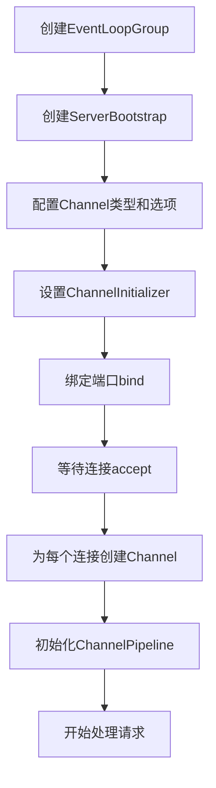
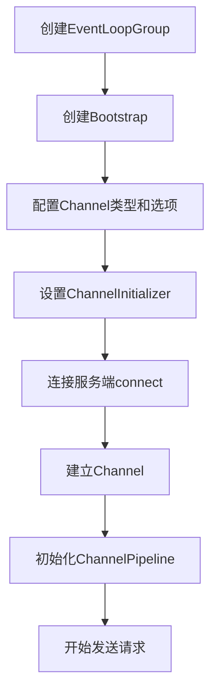
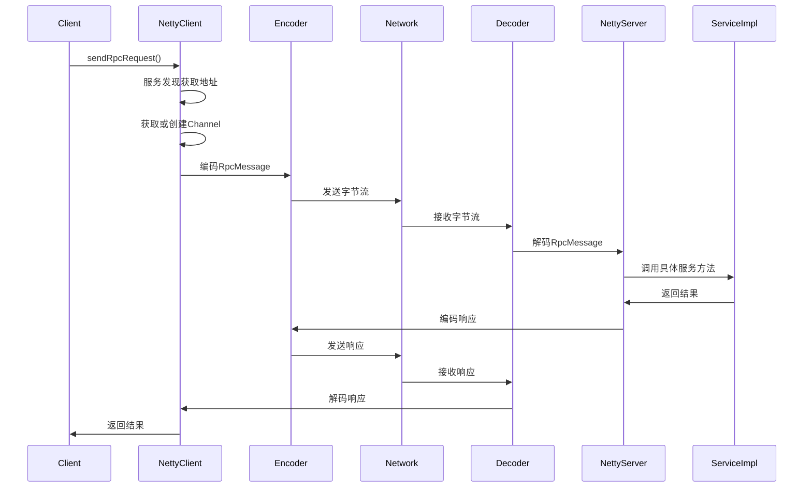

# Netty 架构与调用链路详解

## 目录
- [1. Netty 核心组件架构](#1-netty-核心组件架构)
- [2. 简单示例的代码结构](#2-简单示例的代码结构)
- [3. ChannelPipeline 处理器链](#3-channelpipeline-处理器链)
- [4. RPC 框架中的复杂结构](#4-rpc-框架中的复杂结构)
- [5. Netty 调用链路详解](#5-netty-调用链路详解)
- [6. 编解码器处理流程](#6-编解码器处理流程)
- [7. 关键特性](#7-关键特性)

## 1. Netty 核心组件架构

Netty 的核心架构基于以下几个关键组件：

### 1.1 EventLoopGroup（事件循环组）

```java
// 服务端：两个线程组
EventLoopGroup bossGroup = new NioEventLoopGroup(1);     // 处理连接
EventLoopGroup workerGroup = new NioEventLoopGroup();    // 处理I/O

// 客户端：一个线程组
EventLoopGroup group = new NioEventLoopGroup();
```

**职责分工：**
- **bossGroup**：专门负责接收客户端连接请求
- **workerGroup**：负责处理已建立连接的 I/O 操作

### 1.2 Bootstrap（启动器）

- **ServerBootstrap**：服务端启动器，用于配置和启动服务端
- **Bootstrap**：客户端启动器，用于配置和启动客户端

### 1.3 Channel（通道）

- **NioServerSocketChannel**：服务端通道，基于 NIO 的非阻塞服务端套接字
- **NioSocketChannel**：客户端通道，基于 NIO 的非阻塞客户端套接字

### 1.4 ChannelHandler（处理器）

- **ChannelInboundHandler**：入站处理器，处理读取数据
- **ChannelOutboundHandler**：出站处理器，处理写入数据

## 2. 简单示例的代码结构

### 2.1 服务端结构

```java
public void start() throws InterruptedException {
    // 1. 创建线程组
    // bossGroup 用于接收客户端连接
    EventLoopGroup bossGroup = new NioEventLoopGroup(1);
    // workerGroup 用于处理客户端请求
    EventLoopGroup workerGroup = new NioEventLoopGroup();

    try {
        // 2. 创建服务端启动器
        ServerBootstrap serverBootstrap = new ServerBootstrap();

        // 3. 配置启动器
        serverBootstrap.group(bossGroup, workerGroup)
                .channel(NioServerSocketChannel.class)  // 设置服务端 Channel 类型
                .option(ChannelOption.SO_BACKLOG, 128)  // 设置连接队列大小
                .childOption(ChannelOption.SO_KEEPALIVE, true)  // 保持连接活跃
                .childHandler(new ChannelInitializer<SocketChannel>() {
                    @Override
                    protected void initChannel(SocketChannel ch) {
                        // 4. 设置处理器链
                        ChannelPipeline pipeline = ch.pipeline();
                        pipeline.addLast(new StringDecoder());
                        pipeline.addLast(new StringEncoder());
                        pipeline.addLast(new EchoServerHandler());
                    }
                });

        // 5. 绑定端口并启动服务
        ChannelFuture future = serverBootstrap.bind(port).sync();
        System.out.println("🚀 Netty 服务端启动成功，监听端口：" + port);

        // 6. 等待服务端关闭
        future.channel().closeFuture().sync();
    } finally {
        // 7. 优雅关闭线程组
        bossGroup.shutdownGracefully();
        workerGroup.shutdownGracefully();
    }
}
```

### 2.2 客户端结构

```java
public void start() throws InterruptedException {
    // 1. 创建线程组
    EventLoopGroup group = new NioEventLoopGroup();

    try {
        // 2. 创建客户端启动器
        Bootstrap bootstrap = new Bootstrap();

        // 3. 配置启动器
        bootstrap.group(group)
                .channel(NioSocketChannel.class)  // 设置客户端 Channel 类型
                .option(ChannelOption.SO_KEEPALIVE, true)  // 保持连接活跃
                .handler(new ChannelInitializer<SocketChannel>() {
                    @Override
                    protected void initChannel(SocketChannel ch) {
                        // 4. 设置处理器链
                        ChannelPipeline pipeline = ch.pipeline();
                        pipeline.addLast(new StringDecoder());
                        pipeline.addLast(new StringEncoder());
                        pipeline.addLast(new EchoClientHandler());
                    }
                });

        // 5. 连接服务端
        ChannelFuture future = bootstrap.connect(host, port).sync();
        Channel channel = future.channel();

        // 6. 发送消息
        while (true) {
            String input = scanner.nextLine();
            if ("quit".equalsIgnoreCase(input)) {
                break;
            }
            channel.writeAndFlush(input);
        }
    } finally {
        // 7. 优雅关闭
        group.shutdownGracefully();
    }
}
```

### 2.3 消息处理器

**服务端处理器：**
```java
public class EchoServerHandler extends ChannelInboundHandlerAdapter {
    @Override
    public void channelRead(ChannelHandlerContext ctx, Object msg) {
        String message = (String) msg;
        System.out.println("📨 服务端接收到消息：" + message);

        // 回显消息给客户端
        String response = "服务端回复：" + message;
        ctx.writeAndFlush(response);
    }

    @Override
    public void channelActive(ChannelHandlerContext ctx) {
        System.out.println("🔗 客户端连接建立：" + ctx.channel().remoteAddress());
    }

    @Override
    public void exceptionCaught(ChannelHandlerContext ctx, Throwable cause) {
        System.err.println("💥 服务端发生异常：" + cause.getMessage());
        ctx.close();
    }
}
```

## 3. ChannelPipeline 处理器链

ChannelPipeline 是 Netty 的核心概念，它是一个处理器链：

```java
.childHandler(new ChannelInitializer<SocketChannel>() {
    @Override
    protected void initChannel(SocketChannel ch) {
        ChannelPipeline pipeline = ch.pipeline();

        // 添加处理器（按顺序）
        pipeline.addLast(new StringDecoder());    // 解码器
        pipeline.addLast(new StringEncoder());    // 编码器
        pipeline.addLast(new EchoServerHandler()); // 业务处理器
    }
});
```

### 3.1 处理器执行顺序

- **入站（Inbound）**：从前往后执行
  ```
  网络数据 → StringDecoder → StringEncoder → EchoServerHandler → 业务处理
  ```

- **出站（Outbound）**：从后往前执行
  ```
  业务数据 → EchoServerHandler → StringEncoder → StringDecoder → 网络发送
  ```

### 3.2 处理器类型

| 处理器类型 | 作用 | 典型实现 |
|-----------|------|----------|
| 编解码器 | 数据格式转换 | StringDecoder, StringEncoder |
| 协议处理器 | 协议解析 | HttpServerCodec, WebSocketFrameDecoder |
| 业务处理器 | 业务逻辑 | 自定义 Handler |
| 工具处理器 | 辅助功能 | LoggingHandler, IdleStateHandler |

## 4. RPC 框架中的复杂结构

在 RPC 框架中，Netty 的使用更加复杂，包含了自定义协议、编解码器、心跳机制等。

### 4.1 服务端配置

```java
@SneakyThrows
public void start() {
    // 1. 创建线程组
    EventLoopGroup bossGroup = new NioEventLoopGroup(1);
    EventLoopGroup workerGroup = new NioEventLoopGroup();
    DefaultEventExecutorGroup serviceHandlerGroup = new DefaultEventExecutorGroup(
            RuntimeUtil.cpus() * 2,
            ThreadPoolFactoryUtil.createThreadFactory("service-handler-group", false)
    );

    try {
        // 2. 配置服务端启动器
        ServerBootstrap b = new ServerBootstrap();
        b.group(bossGroup, workerGroup)
                .channel(NioServerSocketChannel.class)
                .childOption(ChannelOption.TCP_NODELAY, true)      // 禁用 Nagle 算法
                .childOption(ChannelOption.SO_KEEPALIVE, true)     // 开启 TCP 心跳
                .option(ChannelOption.SO_BACKLOG, 128)             // 连接队列大小
                .handler(new LoggingHandler(LogLevel.INFO))
                .childHandler(new ChannelInitializer<SocketChannel>() {
                    @Override
                    protected void initChannel(SocketChannel ch) {
                        ChannelPipeline p = ch.pipeline();
                        // 3. 配置处理器链
                        p.addLast(new IdleStateHandler(30, 0, 0, TimeUnit.SECONDS)); // 空闲检测
                        p.addLast(new RpcMessageEncoder());                           // RPC 编码器
                        p.addLast(new RpcMessageDecoder());                           // RPC 解码器
                        p.addLast(serviceHandlerGroup, new NettyRpcServerHandler()); // 业务处理器
                    }
                });

        // 绑定端口并启动服务
        ChannelFuture f = b.bind(host, PORT).sync();
        f.channel().closeFuture().sync();
    } finally {
        bossGroup.shutdownGracefully();
        workerGroup.shutdownGracefully();
        serviceHandlerGroup.shutdownGracefully();
    }
}
```

### 4.2 客户端配置

```java
public NettyRpcClient() {
    // 1. 初始化客户端启动器
    eventLoopGroup = new NioEventLoopGroup();
    bootstrap = new Bootstrap();
    bootstrap.group(eventLoopGroup)
            .channel(NioSocketChannel.class)
            .handler(new LoggingHandler(LogLevel.INFO))
            .option(ChannelOption.CONNECT_TIMEOUT_MILLIS, 5000)  // 连接超时
            .handler(new ChannelInitializer<SocketChannel>() {
                @Override
                protected void initChannel(SocketChannel ch) {
                    ChannelPipeline p = ch.pipeline();
                    // 心跳检测：5秒内没有写操作就发送心跳
                    p.addLast(new IdleStateHandler(0, 5, 0, TimeUnit.SECONDS));
                    p.addLast(new RpcMessageEncoder());      // RPC 编码器
                    p.addLast(new RpcMessageDecoder());      // RPC 解码器
                    p.addLast(new NettyRpcClientHandler());  // 客户端处理器
                }
            });

    // 初始化服务发现和请求管理
    this.serviceDiscovery = ExtensionLoader.getExtensionLoader(ServiceDiscovery.class)
            .getExtension(ServiceDiscoveryEnum.ZK.getName());
    this.unprocessedRequests = SingletonFactory.getInstance(UnprocessedRequests.class);
    this.channelProvider = SingletonFactory.getInstance(ChannelProvider.class);
}
```

## 5. Netty 调用链路详解

### 5.1 服务端启动流程



### 5.2 客户端连接流程



### 5.3 消息处理流程

#### 入站消息处理（服务端接收）


#### 出站消息处理（服务端发送）


### 5.4 RPC 框架的完整调用链路



### 5.5 客户端发送请求详细流程

```java
@Override
public Object sendRpcRequest(RpcRequest rpcRequest) {
    CompletableFuture<RpcResponse<Object>> resultFuture = new CompletableFuture<>();

    // 1. 获取服务的地址
    InetSocketAddress inetSocketAddress = serviceDiscovery.lookupService(rpcRequest);

    // 2. 获取channel
    Channel channel = getChannel(inetSocketAddress);

    if (channel.isActive()) {
        // 3. 发送请求
        unprocessedRequests.put(rpcRequest.getRequestId(), resultFuture);
        RpcMessage rpcMessage = RpcMessage.builder()
                .data(rpcRequest)
                .codec(SerializationTypeEnum.HESSIAN.getCode())
                .compress(CompressTypeEnum.GZIP.getCode())
                .messageType(RpcConstants.REQUEST_TYPE)
                .build();

        channel.writeAndFlush(rpcMessage).addListener((ChannelFutureListener) future -> {
            if (future.isSuccess()) {
                log.info("client send message: [{}]", rpcMessage);
            } else {
                future.channel().close();
                resultFuture.completeExceptionally(future.cause());
                log.error("Send failed:", future.cause());
            }
        });
    }

    // 4. 得到响应的结果
    try {
        return resultFuture.get();
    } catch (InterruptedException | ExecutionException e) {
        throw new RuntimeException("rpc请求失败," + e.getMessage());
    }
}
```

### 5.6 服务端处理请求详细流程

```java
@Override
public void channelRead(ChannelHandlerContext ctx, Object msg) {
    try {
        if (msg instanceof RpcMessage) {
            log.info("server receive msg: [{}] ", msg);
            byte messageType = ((RpcMessage) msg).getMessageType();
            RpcMessage rpcMessage = new RpcMessage();
            rpcMessage.setCodec(SerializationTypeEnum.HESSIAN.getCode());
            rpcMessage.setCompress(CompressTypeEnum.GZIP.getCode());

            if (messageType == RpcConstants.HEARTBEAT_REQUEST_TYPE) {
                // 处理心跳请求
                rpcMessage.setMessageType(RpcConstants.HEARTBEAT_RESPONSE_TYPE);
                rpcMessage.setData(RpcConstants.PONG);
            } else {
                // 处理RPC请求
                RpcRequest rpcRequest = (RpcRequest) ((RpcMessage) msg).getData();
                // 执行目标方法并返回结果
                Object result = rpcRequestHandler.handle(rpcRequest);
                log.info(String.format("server get result: %s", result.toString()));

                rpcMessage.setMessageType(RpcConstants.RESPONSE_TYPE);
                if (ctx.channel().isActive() && ctx.channel().isWritable()) {
                    RpcResponse<Object> rpcResponse = RpcResponse.success(result, rpcRequest.getRequestId());
                    rpcMessage.setData(rpcResponse);
                } else {
                    RpcResponse<Object> rpcResponse = RpcResponse.fail(RpcResponseCodeEnum.FAIL);
                    rpcMessage.setData(rpcResponse);
                    log.error("not writable now, message dropped");
                }
            }
            ctx.writeAndFlush(rpcMessage).addListener(ChannelFutureListener.CLOSE_ON_FAILURE);
        }
    } finally {
        // 确保 ByteBuf 被释放，否则可能导致内存泄漏
        ReferenceCountUtil.release(msg);
    }
}
```

## 6. 编解码器处理流程

### 6.1 自定义协议格式

RPC 框架使用自定义的二进制协议：

```
 0     1     2     3     4        5     6     7     8         9          10      11     12  13  14   15 16
 +-----+-----+-----+-----+--------+----+----+----+------+-----------+-------+----- --+-----+-----+-------+
 |   magic   code        |version | full length         | messageType| codec|compress|    RequestId       |
 +-----------------------+--------+---------------------+-----------+-----------+-----------+------------+
 |                                                                                                       |
 |                                         body                                                          |
 |                                                                                                       |
 |                                        ... ...                                                        |
 +-------------------------------------------------------------------------------------------------------+
```

**字段说明：**
- **magic code（4B）**：魔法数，用于识别协议
- **version（1B）**：版本号
- **full length（4B）**：消息总长度
- **messageType（1B）**：消息类型（请求/响应/心跳）
- **codec（1B）**：序列化类型
- **compress（1B）**：压缩类型
- **requestId（4B）**：请求ID
- **body**：消息体（序列化后的对象）

### 6.2 编码器实现

```java
@Override
protected void encode(ChannelHandlerContext ctx, RpcMessage rpcMessage, ByteBuf out) {
    try {
        // 1. 写入魔法数
        out.writeBytes(RpcConstants.MAGIC_NUMBER);
        // 2. 写入版本号
        out.writeByte(RpcConstants.VERSION);
        // 3. 预留长度字段位置
        out.writerIndex(out.writerIndex() + 4);

        // 4. 写入消息类型
        byte messageType = rpcMessage.getMessageType();
        out.writeByte(messageType);
        // 5. 写入编解码类型
        out.writeByte(rpcMessage.getCodec());
        // 6. 写入压缩类型
        out.writeByte(CompressTypeEnum.GZIP.getCode());
        // 7. 写入请求ID
        out.writeInt(ATOMIC_INTEGER.getAndIncrement());

        // 8. 处理消息体
        byte[] bodyBytes = null;
        int fullLength = RpcConstants.HEAD_LENGTH;

        if (messageType != RpcConstants.HEARTBEAT_REQUEST_TYPE
                && messageType != RpcConstants.HEARTBEAT_RESPONSE_TYPE) {
            // 序列化对象
            String codecName = SerializationTypeEnum.getName(rpcMessage.getCodec());
            Serializer serializer = ExtensionLoader.getExtensionLoader(Serializer.class)
                    .getExtension(codecName);
            bodyBytes = serializer.serialize(rpcMessage.getData());

            // 压缩字节数组
            String compressName = CompressTypeEnum.getName(rpcMessage.getCompress());
            Compress compress = ExtensionLoader.getExtensionLoader(Compress.class)
                    .getExtension(compressName);
            bodyBytes = compress.compress(bodyBytes);
            fullLength += bodyBytes.length;
        }

        // 9. 写入消息体
        if (bodyBytes != null) {
            out.writeBytes(bodyBytes);
        }

        // 10. 回填长度字段
        int writeIndex = out.writerIndex();
        out.writerIndex(writeIndex - fullLength + RpcConstants.MAGIC_NUMBER.length + 1);
        out.writeInt(fullLength);
        out.writerIndex(writeIndex);
    } catch (Exception e) {
        log.error("Encode request error!", e);
    }
}
```

### 6.3 解码器实现

```java
private Object decodeFrame(ByteBuf in) {
    // 1. 检查魔法数
    checkMagicNumber(in);
    // 2. 检查版本号
    checkVersion(in);
    // 3. 读取消息长度
    int fullLength = in.readInt();

    // 4. 构建 RpcMessage 对象
    byte messageType = in.readByte();
    byte codecType = in.readByte();
    byte compressType = in.readByte();
    int requestId = in.readInt();

    RpcMessage rpcMessage = RpcMessage.builder()
            .codec(codecType)
            .requestId(requestId)
            .messageType(messageType)
            .build();

    // 5. 处理心跳消息
    if (messageType == RpcConstants.HEARTBEAT_REQUEST_TYPE) {
        rpcMessage.setData(RpcConstants.PING);
        return rpcMessage;
    }
    if (messageType == RpcConstants.HEARTBEAT_RESPONSE_TYPE) {
        rpcMessage.setData(RpcConstants.PONG);
        return rpcMessage;
    }

    // 6. 处理普通消息
    int bodyLength = fullLength - RpcConstants.HEAD_LENGTH;
    if (bodyLength > 0) {
        byte[] bs = new byte[bodyLength];
        in.readBytes(bs);

        // 解压缩
        String compressName = CompressTypeEnum.getName(compressType);
        Compress compress = ExtensionLoader.getExtensionLoader(Compress.class)
                .getExtension(compressName);
        bs = compress.decompress(bs);

        // 反序列化
        String codecName = SerializationTypeEnum.getName(rpcMessage.getCodec());
        Serializer serializer = ExtensionLoader.getExtensionLoader(Serializer.class)
                .getExtension(codecName);

        if (messageType == RpcConstants.REQUEST_TYPE) {
            RpcRequest tmpValue = serializer.deserialize(bs, RpcRequest.class);
            rpcMessage.setData(tmpValue);
        } else {
            RpcResponse tmpValue = serializer.deserialize(bs, RpcResponse.class);
            rpcMessage.setData(tmpValue);
        }
    }
    return rpcMessage;
}
```

## 7. 关键特性

### 7.1 异步非阻塞

**EventLoop 模型：**
- 每个 EventLoop 绑定一个线程
- 使用事件驱动模型处理 I/O 事件
- 基于回调和 Future 机制实现异步操作

```java
// 异步发送消息
channel.writeAndFlush(message).addListener((ChannelFutureListener) future -> {
    if (future.isSuccess()) {
        System.out.println("消息发送成功");
    } else {
        System.out.println("消息发送失败");
        future.cause().printStackTrace();
    }
});
```

### 7.2 零拷贝

**实现方式：**
- 使用 DirectBuffer 减少内存拷贝
- 通过 FileRegion 实现文件传输优化
- CompositeByteBuf 组合多个 ByteBuf

```java
// 使用 DirectBuffer
ByteBuf directBuffer = PooledByteBufAllocator.DEFAULT.directBuffer(1024);

// 文件零拷贝传输
FileRegion region = new DefaultFileRegion(file, 0, file.length());
channel.writeAndFlush(region);
```

### 7.3 内存管理

**池化技术：**
- 池化的 ByteBuf 减少 GC 压力
- 引用计数管理内存释放
- 内存泄漏检测

```java
// 引用计数管理
ByteBuf buf = ctx.alloc().buffer();
try {
    // 使用 buf
} finally {
    buf.release(); // 释放引用
}

// 或者使用 ReferenceCountUtil
try {
    // 处理消息
} finally {
    ReferenceCountUtil.release(msg);
}
```

### 7.4 协议支持

**解决 TCP 粘包拆包：**
- LengthFieldBasedFrameDecoder：基于长度字段的解码器
- DelimiterBasedFrameDecoder：基于分隔符的解码器
- FixedLengthFrameDecoder：固定长度解码器

```java
// 基于长度字段的解码器
public RpcMessageDecoder() {
    // lengthFieldOffset: 长度字段偏移量
    // lengthFieldLength: 长度字段长度
    // lengthAdjustment: 长度调整值
    // initialBytesToStrip: 跳过的字节数
    super(RpcConstants.MAX_FRAME_LENGTH, 5, 4, -9, 0);
}
```

### 7.5 心跳机制

**空闲检测：**
```java
// 30秒内没有读操作就触发空闲事件
p.addLast(new IdleStateHandler(30, 0, 0, TimeUnit.SECONDS));

// 处理空闲事件
@Override
public void userEventTriggered(ChannelHandlerContext ctx, Object evt) throws Exception {
    if (evt instanceof IdleStateEvent) {
        IdleState state = ((IdleStateEvent) evt).state();
        if (state == IdleState.READER_IDLE) {
            log.info("读空闲，关闭连接");
            ctx.close();
        } else if (state == IdleState.WRITER_IDLE) {
            log.info("写空闲，发送心跳");
            sendHeartbeat(ctx);
        }
    }
}
```

## 总结

Netty 作为一个高性能的网络编程框架，通过其优雅的架构设计和丰富的特性，为开发者提供了强大的网络编程能力：

1. **组件化设计**：EventLoopGroup、Bootstrap、Channel、Handler 等组件各司其职
2. **管道模式**：ChannelPipeline 提供了灵活的处理器链机制
3. **异步非阻塞**：基于事件驱动的异步 I/O 模型
4. **内存优化**：零拷贝、池化技术、引用计数等内存管理机制
5. **协议支持**：丰富的编解码器解决各种协议问题

从简单的 Echo 服务到复杂的 RPC 框架，Netty 都能提供稳定、高效的网络通信支持。理解其架构和调用链路，有助于我们更好地使用 Netty 构建高性能的网络应用。

